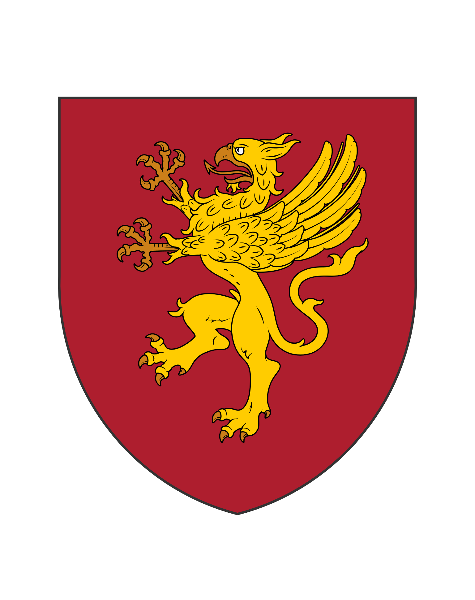

## Position stratégique nordique

Situé dans les régions nordiques, le royaume de Jordbrest occupe une position stratégique entre Poldrast-Litarn et les territoires plus septentrionaux. Fondé en 1004 par Garlil Ier, ce royaume doit son nom à la cité établie sur les rives du lac Jordbr, qui devint rapidement le centre politique et commercial de la région.

## Expansion territoriale

Initialement limité à ce lac et ses environs immédiats, Jordbrest connut une expansion territoriale progressive jusqu'en 1208, date à laquelle ses frontières actuelles furent essentiellement établies. Cette croissance, principalement réalisée aux dépens de tribus moins organisées et de petites principautés voisines, fut caractérisée par une alternance de conquêtes militaires et d'intégrations pacifiques par mariages ou traités.

## Géographie et structure politique

Le royaume bénéficie d'un réseau de rivières qui facilite les transports et le commerce, sans pour autant dominer l'ensemble de son économie. Comme tout royaume féodal, Jordbrest voit son territoire morcelé entre différents seigneurs qui exercent une autorité quasi-absolue sur leurs domaines respectifs, tout en reconnaissant la suzeraineté théorique du souverain.

## Relations conflictuelles avec le Tsarat de Nivsk

### Tensions historiques

Les relations de Jordbrest avec le Tsarat de Nivsk à l'est ont été historiquement tendues, ponctuées par des conflits récurrents depuis 1216. Ces guerres, généralement déclenchées par des disputes territoriales ou des querelles dynastiques, ont contribué à forger une certaine cohésion face à cette menace commune.

### L'occupation de la capitale (1378-1379)

L'épisode le plus dramatique survint en 1378, lorsque les forces nivskes s'emparèrent brièvement de la capitale Jordbr, avant d'être repoussées l'année suivante grâce à l'intervention décisive de contingents poldrasto-litarniens.

## Gouvernance actuelle

Le roi actuel, Branimir IV, règne depuis sa forteresse de Jordbr, centre administratif et symbolique du royaume. Son autorité effective s'étend principalement sur ses domaines personnels, tandis que les grands seigneurs régionaux conduisent largement leurs affaires selon leurs propres intérêts, se ralliant à la couronne principalement face aux menaces extérieures.

## Relations avec Virmian

Les relations entre Jordbrest et Virmian, bien que limitées par la distance, demeurent généralement cordiales, fondées principalement sur des intérêts commerciaux et une méfiance commune envers certains voisins. Des marchands jordbrestes visitent occasionnellement nos foires nordiques, apportant ambre, fourrures et produits forestiers exotiques en échange de nos vins, métaux travaillés et textiles fins.