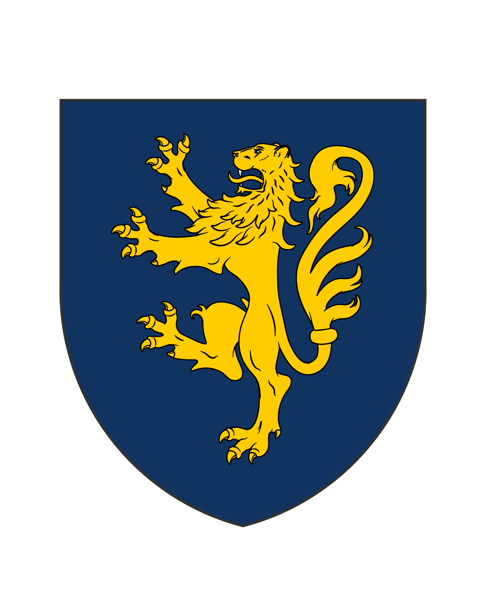

## Introduction

Aux septentrion du monde civilisé s'étendent deux ensembles politiques et culturels contrastés : les Principautés Nordiques et les territoires Blarst.

## Les Principautés Nordiques

### Structure politique confédérée

Les Principautés Nordiques constituent une confédération lâche d'entités politiques semi-autonomes partageant certaines caractéristiques culturelles et linguistiques, mais jalouses de leurs prérogatives individuelles. Contrairement à ce que suggèrent certains récits fantaisistes qui les dépeignent comme des guerriers barbares, ces populations sont principalement tournées vers le commerce maritime et l'exploitation des ressources forestières. Leur culture se rapproche de celle de Valencourt et de Vostrag, que ce soit dans les noms, l'administration ou les différentes pratiques. Ceci est dû à l'origine des principautés, fondées sous le royaume de Mirst par des marchands vostragiens ayant été bannis pour de sombres affaires de la resplendissante cité.

### Économie commerciale

Leur économie repose largement sur le négoce international, leurs marchands et navigateurs ayant établi des routes commerciales étendues le long des côtes septentrionales. Cet esprit mercantile les place en rivalité directe avec Vostrag pour le contrôle de certaines voies maritimes stratégiques, situation qui a occasionnellement conduit à des confrontations ouvertes comme la tentative de raid sur Vostrag en 1397.

### Organisation sociale mercantile

La société des Principautés présente certaines similitudes intéressantes avec celle des cités comme Vostrag ou les communes de Valencourt, particulièrement dans l'importance accordée aux associations marchandes et aux corporations qui jouent un rôle crucial dans la gouvernance locale. Cette organisation sociale, combinée à une éthique de travail rigoureuse, a permis le développement d'une prospérité considérable malgré des conditions naturelles parfois difficiles.

## Les Peuples Blarst

### Recul territorial historique

Plus au nord, par dela la Nordmaf, s'étendent les vastes domaines des peuples Blarst, considérés comme barbares par l'ensemble du monde dastaïte. Ces peuples, autrefois maîtres de territoires bien plus étendus incluant les actuels Poldrast-Litarn et Fijurod, ont été progressivement repoussés vers les régions septentrionales les plus inhospitalières suite à une série de défaites militaires.

### Organisation tribale

La société Blarst s'organise autour d'unités tribales semi-nomades dirigées par des chefs héréditaires dont l'autorité dépend largement de leurs succès militaires et de leur capacité à redistribuer les richesses acquises. Ces tribus, bien que fréquemment en conflit entre elles pour le contrôle des ressources limitées de leur environnement, peuvent néanmoins s'unir temporairement face à une menace extérieure commune.

### Économie traditionnelle

Leur économie traditionnelle combine chasse, pêche, élevage transhumant, et raids occasionnels contre les communautés sédentaires méridionales. Ces dernières activités, bien que considérablement limitées par le renforcement des défenses frontalières des royaumes dastaïtes, demeurent suffisamment fréquentes pour maintenir un état de tension permanente le long des marches septentrionales de Fijurod et Poldrast-Litarn.

### Chamanisme et traditions spirituelles

Sur le plan religieux, les Blarst pratiquent un chamanisme complexe centré sur la vénération des esprits naturels et animaux, ainsi que sur le culte des ancêtres. Leurs chamanes, figures centrales de l'autorité spirituelle, combinent fonctions sacerdotales, médicinales et divinatoires, leur prestige social dépendant largement de leur capacité perçue à communiquer avec le monde invisible.