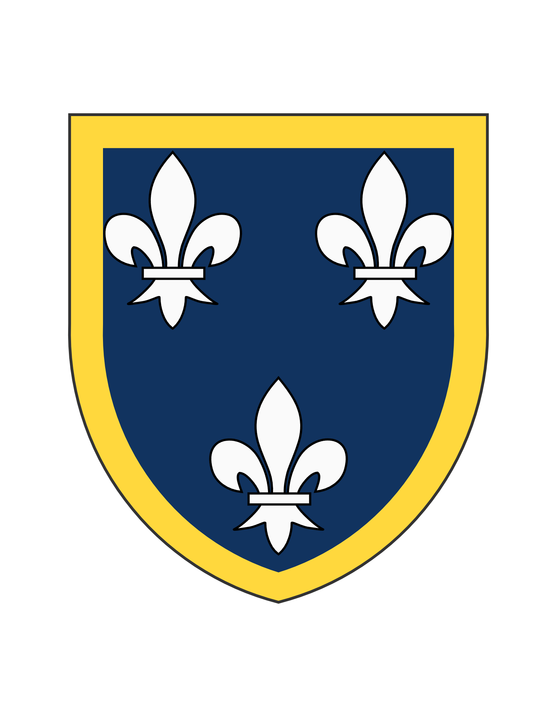

# ⚜ Le Grand Royaume de Virmian ⚜
*Bastion de la Foi [Dastaïte](Dastaisme.html) et Fleuron de la Chevalerie*

## Un Héritage Millénaire

Érigé en 565 sur les cendres fumantes du vénérable empire de [Mirst](mirst.html), le Grand Royaume de Virmian s'impose depuis près d'un millénaire comme l'une des puissances dominantes du monde connu. Fondé par la glorieuse dynastie des Harcourt, qui régna pendant cinq siècles avant de céder le trône aux Valder en 1040, ce royaume a su traverser les vicissitudes de l'histoire pour forger une identité unique, mêlant foi ardente, excellence chevaleresque et prospérité marchande.

## Le Cœur du Royaume : Valder la Magnifique

Au centre de cette construction politique se dresse [Valder](domaine_royal.html), capitale rayonnante de 150 000 âmes, joyau architectural érigé sur les rives de l'Avinau. Ses sept tours cathédraliques percent les cieux comme autant de prières de pierre, tandis que le célèbre pont d'Harcourt, véritable rue suspendue couronnée de son fort imprenable, symbolise la grandeur virmienne. Le palais royal, agrandi par chaque dynastie, et l'Université fondée en 1211 font de cette cité un foyer de pouvoir temporel, spirituel et intellectuel sans égal.

## Les Provinces : Une Mosaïque de Richesses

Le royaume s'étend en une mosaïque de duchés aux caractères distinctifs :

**[Emerance](Emerance_base.html)**, l'ancien royaume conquis et pacifié, traditionnellement gouverné par l'héritier du trône, déploie ses montagnes riches en minerais et ses côtes battues par les vents, où prospèrent salines et troupeaux à la laine réputée.

**[Valencourt](Valencourt_base.html)**, carrefour commercial vers la cité-État de Vostrag, brille par ses riches communes drapières aux libertés chèrement acquises lors de sanglantes révoltes urbaines. Ses milices bourgeoises rivalisent en discipline avec les meilleures troupes du royaume.

**[Valdorin](Valdorin_base.html)**, terre d'opulence et de raffinement, produit les vins les plus prisés du monde connu. Ses seigneurs dorés cultivent un art de vivre somptuaire qui influence les cours jusqu'aux confins du continent.

**[Gaucourt](Gaucourt_base.html)**, cœur spirituel de la chevalerie virmienne, résonne des exploits de ses preux et de la renommée de ses tournois. Ses forêts anciennes et ses terres fertiles nourrissent les plus pures traditions aristocratiques.

**[Almar](Almar_base.html)**, province méridionale aux influences mistraliennes, ouvre le royaume sur la mer Mistral. Ses cités cosmopolites et sa flotte aguerrie maintiennent les liens commerciaux avec l'Empire Aurien et les terres lointaines.

**[Volmarn](Volmarn_base.html)** Terre encore marquée par les cicatrices du "Roi des Bandits", demeure un territoire de vigilance face aux ambitions d'Autchburg et de ses pairs vassalique.

## Foi et Épée : Le Culte [Dastaïte](Dastaisme.html)

La foi [Dastaïte](Dastaisme.html) imprègne chaque aspect de la vie virmienne. Introduit par Saint Arvélan le Purificateur, ce culte prône l'équilibre entre contemplation et action guerrière selon le précepte : "Par la foi et par l'épée, l'homme juste servira Dast." Les ordres monastiques se divisent entre Contemplateurs voués à l'étude et Défenseurs-soldats comme les célèbres Chevaliers de la Rose Blanche. Le Primat des Lanvain, depuis la Grande Cathédrale de Valder, représente l'autorité du Sanctriarque d'Ostia dans le royaume.

## Épreuves et Triomphes

L'histoire virmienne fut jalonnée d'épreuves qui forgèrent sa grandeur. Les guerres contre Autchburg, notamment la victoire décisive de Sodanburg (1502-1503) où fut capturé le roi Venceslas III, établirent la prééminence militaire du royaume. Les crises intérieures - révolte du Prévôt Marchand (1173-1175), guerre des Communes valenciennes (1195-1201), ou Praguerie aristocratique (1238-1240) - renforcèrent paradoxalement l'autorité royale en démontrant les périls de sa division.

L'épisode tragique du "Roi des Bandits" Albert d'Arsenbel (1459-1464), qui ravagea Volmarn avant d'être écrasé, rappela la vigilance nécessaire contre l'anarchie. À l'inverse, l'épopée glorieuse de Farzan, fils bâtard royal qui conquit son propre domaine en Haute-Garslat (1471-1477), illustre l'esprit d'aventure et d'honneur qui anime la noblesse virmienne.

## Puissance et Rayonnement

La force du royaume repose sur une armée permanente, complétée par les contingents féodaux et les redoutables milices urbaines. Sa flotte, particulièrement celle d'Almar aux galères rapides et de Valdorin aux navires somptuaires, sillonne les mers du sud au nord.

L'économie florissante s'appuie sur l'excellence artisanale - draps valenciens, vins valdorins, aciers émerançois -, le commerce international via les foires renommées, et les richesses agricoles de terres fécondes. La diplomatie virmienne a su étendre l'influence royale par la vassalisation du royaume d'Arrsriv et de multiples alliances matrimoniales.

## Le Présent : Grandeur et Défis (1515)

Sous le règne d'Halsden II de Valder, monarque de 48 ans régnant depuis vingt-trois ans, le royaume jouit d'une prospérité remarquable malgré les tensions persistantes. L'administration modernisée - Chambre des Comptes, Cours d'Assises, Université - témoigne de la sophistication gouvernementale atteinte.

Cependant, des préoccupations assombrissent l'horizon : le dauphin Arlen (21 ans), préférant chasse et tournois aux affaires d'État, inquiète par son apparente légèreté ; les princes Folstan et Harzen cultivent leurs propres ambitions ; les grands duchés conservent une autonomie parfois gênante pour l'unité royale ; et la rivalité séculaire avec Autchburg demeure menaçante.

## Un Avenir Radieux

Malgré ces défis, le Grand Royaume de Virmian demeure l'une des puissances prépondérantes du monde connu. Forte de son héritage glorieux, de ses institutions éprouvées, de sa foi ardente et de sa noblesse chevaleresque, cette construction politique unique continue de rayonner bien au-delà de ses frontières, incarnant un modèle d'équilibre entre tradition et modernité, entre pouvoir central et libertés locales, entre gloire militaire et prospérité civile.

*Que Dast bénisse et préserve cette noble entreprise pour les siècles à venir.*

[**Pour une version plus complète**](Virmian_avancé.html)