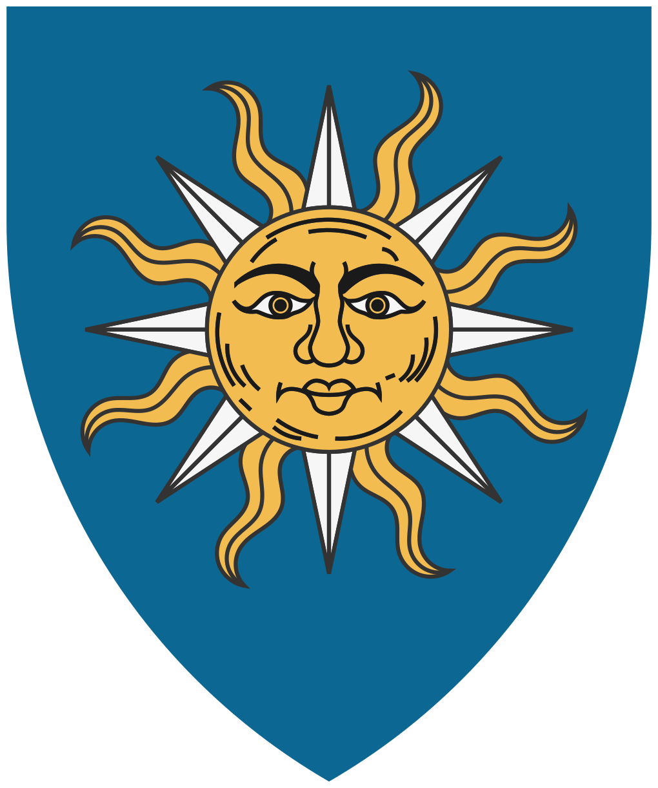

# Les coeurs d'or

Cette faction regroupe l'ensemble des prêtres de l'île et les membres de l'Ordre des Purificateurs, formant un bloc où l'autorité spirituelle et la force militaire se confondent. Leur figure centrale est **Serath**, la Main d'Or, dont les écrits et la sagesse théologique font autorité au sein de l'institution. Contrairement aux familles nobles, le clergé affiche un désintérêt pour l'exercice direct du pouvoir politique, préférant se concentrer sur la consolidation du dogme et l'expansion de la foi de Varûn à travers le monde.

Toutefois, cette humilité affichée n'exclut pas une influence majeure sur la gestion de la cité. L'organisation est officiellement reconnue comme le bras armé de Léos. L’Ordre des Purificateurs assure la sécurité intérieure et le maintien de l’orthodoxie religieuse par des méthodes rigoureuses. Leurs patrouilles sont fréquentes dans les quartiers populaires, où ils organisent des rafles et des contrôles ciblés pour identifier les dissidents.

Pour le clergé, la prospérité de Léos n'est pas une fin en soi, mais le socle nécessaire au rayonnement de leur foi. Ils perçoivent la Cité Rouge comme un phare destiné à éclairer les nations obscures.