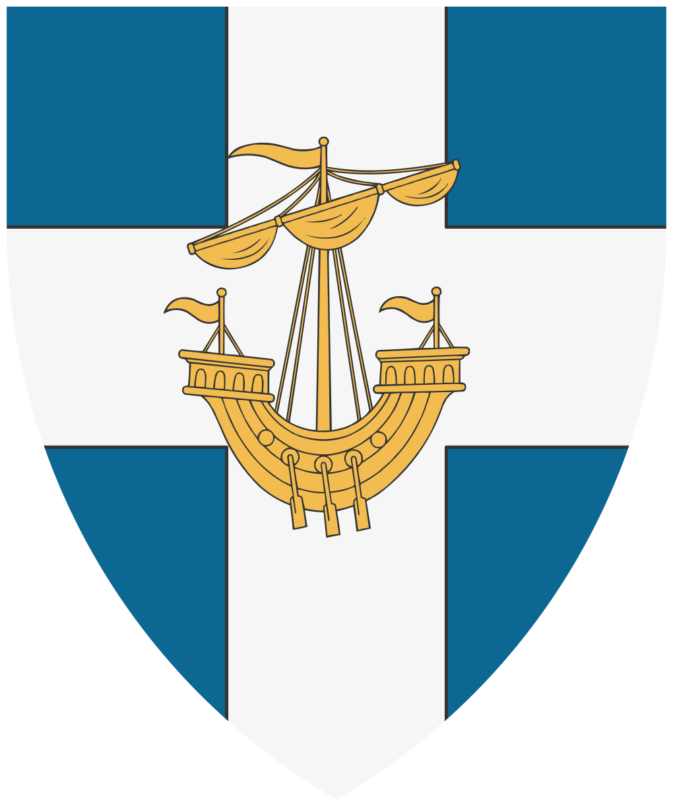

# Les mains d'or

La Guilde des Marchands, couramment appelée **"les Mains d’Or"**, est la principale puissance économique de l’île de Léos. Dirigée par le maître de guilde **Enzo Cavallaro**, elle regroupe la quasi-totalité des négociants, armateurs et courtiers de la cité. Basée à proximité immédiate des docks, l’organisation est devenue le pivot indispensable de la prospérité de la Cité Rouge.

À l'origine, la guilde était un simple groupement d'intérêt destiné à porter les doléances des marchands lors des audiences du Grand Prince Kael. Cependant, avec l'expansion du commerce maritime, elle a progressivement étendu son influence jusqu'à s'immiscer dans les décisions stratégiques du palais. Son objectif demeure le pragmatisme : assurer la sécurité des échanges et maximiser les profits de ses membres, quitte à peser lourdement sur la diplomatie insulaire.

Bien qu'elle garantisse la richesse de l'île, la guilde est perçue avec suspicion par la noblesse traditionnelle, qui voit en elle une oligarchie de l'ombre.