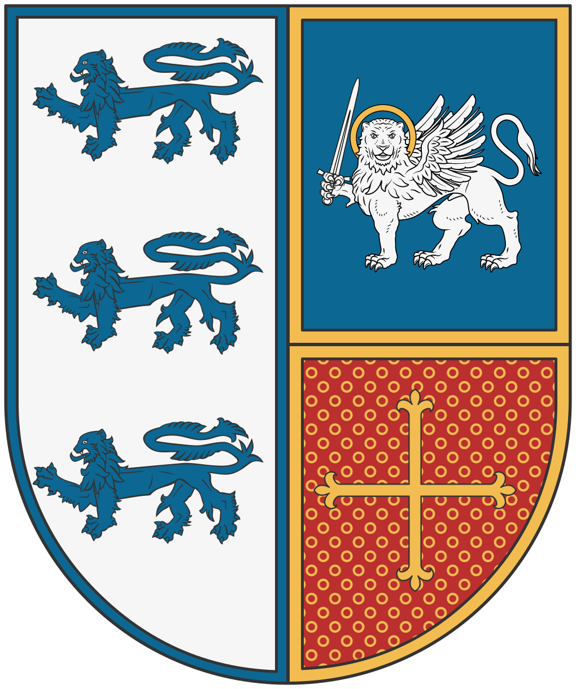

# Les sangs d'or

La faction des Sangs d’Or rassemble l'ensemble des individus liés, de manière directe ou collatérale, à la Maison Vareli, la lignée du Grand Prince Kael. Constituant le cœur de la haute aristocratie de Léos, cette caste fonde sa légitimité sur la pureté de son sang et l'ancienneté de son nom. Leur objectif principal est le maintien d'une stabilité politique stricte, garantissant la pérennité du trône des Vareli et leur autorité absolue sur les affaires de la cité.

Depuis plusieurs générations, les membres de la Maison Vareli monopolisent les postes de conseillers de haut rang et les fonctions administratives clés au sein du palais. Ils sont les architectes de la politique étrangère de l'île, utilisant la diplomatie matrimoniale et les alliances de sang pour étendre l'influence de Léos sur le continent. Cette cohésion familiale, marquée par une absence quasi totale de dissidences internes, fait des Vareli le bloc politique le plus solide de la cité, capable de faire front commun lors des crises majeures.

Cependant, cette unité est le reflet d'une posture défensive face à l'émergence de nouveaux pôles de pouvoir. Les Vareli entretiennent une rivalité constante avec la Guilde des Marchands, dont ils voient l'ascension financière comme une menace directe pour l'hégémonie de la noblesse, ainsi qu'avec le nouveau clergé de Serath. Pour les habitants, les Sangs d'Or incarnent la permanence du pouvoir, mais aussi une élite fermée dont les intérêts dynastiques passent souvent avant les nécessités du petit peuple.
