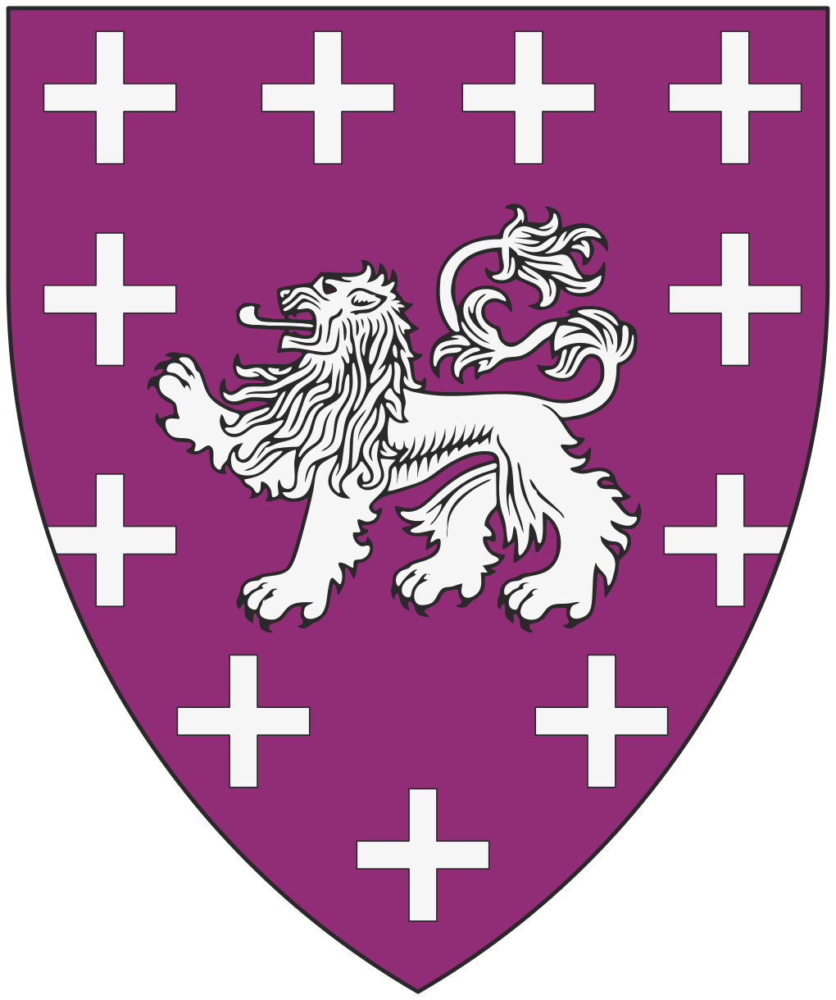

# Serathisme

*Courant religieux uniquement présent sur [l'île de Léos](../royaumes/leos.md)*

Les partisans du Serathisme s'appellent entre eux les **Serathiste**.

## Clergé

- **Les Veilleurs :** les novices et gardes du temple de Léos. Ils tiennent le même rôle que les veilleurs des [enfants de Varûn](varunat.md).
- **Les Porteurs de Sang :** les officiants, ceux qui ont reçu une marque au fer chaud en forme de cercle solaire sur la paume, et qui peuvent célébrer les rites. Ils sont les confesseurs, ces intermédiaires entre le peuple et Varûn.
- **La Main d'Or :** actuellement une homme nommé **Serath de [Léos](../royaumes/leos.md)**, cousin éloigné du prince et théologien redoutable. C'est lui qui a rédigé le texte fondateur du culte, le livre *La Descente*, et qui gère les relations tendues avec le clergé du continent.

## La Quatrième voix

Il est dit dans *la Descente* qu'il existe une quatrième voix de celle

- **La voix de l'Or :** Varûn communique avec ses fidèles par ses élus, comme le Grand Prince **Kael** de la [Cité de léos](../royaumes/leos.md).

## La croix

En plus du lion, qui est le symbole des [enfants de  Varûn](varunat.md), l'ordre et ses adeptes utilisent une croix comme symbole du passage de Varûn sur l'île de Léos. La barre horizontale représente l'île ou, plus généralement, la terre où les Hommes vivent, et la barre verticale montre la présence de Varûn, des cieux jusque dans les profondeurs du monde.

## Tensions avec le clergé officiel

Les Crinières Brûlées tolèrent l'Ordre du Sang Doré pour deux raisons pragmatiques : Léos est stratégiquement utile, ses ports et sa localisation, et Serath est suffisamment prudent pour ne jamais revendiquer ouvertement la divinité en dehors de l'île. Il est dit que Kael est *porteur de sang*, pas qu'il est dieu.

Mais la Main d'Or Serath est moins prudente. Ses écrits circulent sur le continent depuis trois ans, et plusieurs jeunes Crinières Brûlées ont été renvoyés de leur temple pour les avoir lus en secret.

## L'ordre des purificateurs

L'Ordre des Purificateurs constitue le bras armé du Sérathisme sur l'île. Garde personnelle du Grand Prince Kael et milice sacrée, ils font régner la volonté de la Main d’Or Serath dans chaque ruelle de Léos.

Reconnaissables à leur discipline de fer, ils assurent la sécurité du Palais et la pureté de la foi. Leur autorité se manifeste par des rafles soudaines dans les quartiers suspects et l’exigence d’une taxe de piété imposée aux non-adeptes, perçue comme le prix de la protection divine.

Établis dans un monastère fortifié qui domine la ville, les Purificateurs sont craints pour leur ferveur. Ils ne servent aucun dogme du continent : ils sont les boucliers de Kael et les instruments de Serath, veillant à ce que l'éclat de Léos ne soit jamais souillé par le doute ou l'[hérésie des cendres](varunat.md).
