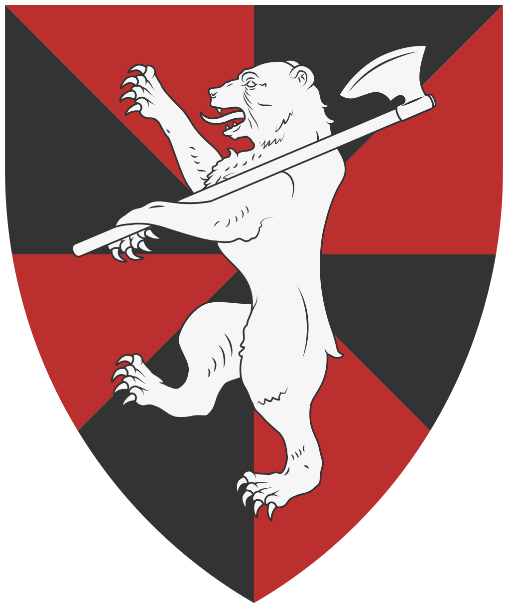

*Blason souvent associé aux tribus Arédiques*

Les tribus arédiques occupent les massifs escarpés du Nord-Est, s'étendant le long des contreforts montagneux qui bordent le continent. Leur mode de vie est essentiellement troglodytique, s'appuyant sur l'occupation de vastes réseaux de cavités naturelles que les tribus agrandissent et relient par des galeries creusées à même la roche. Cette architecture souterraine leur permet de se protéger des variations climatiques brutales de la région tout en constituant un dispositif défensif presque imprenable.

Bien que les érudits les regroupent sous une appellation unique, les Arédiques ne possèdent aucune autorité centrale ou hiérarchie globale. Ils s'organisent en clans familiaux autonomes, soudés par une culture et un dialecte communs, mais politiquement indépendants. Cette absence de structure unifiée rend toute tentative de négociation diplomatique avec les puissances étrangères complexe, car aucun chef n'a le pouvoir d'engager d'autres clans que le sien. Les relations entre les différentes tribus oscillent régulièrement entre l'alliance de circonstance et des conflits de voisinage pour le contrôle des zones de chasse ou des filons miniers.

L'identité arédique est indissociable de la figure de l'ours, animal qu'ils domestiquent. Utilisés comme montures et bêtes de somme, ces animaux sont des marqueurs de puissance et de prestige au sein de la communauté. La présence de ces prédateurs au sein des campements renforce l'agressivité naturelle des tribus envers les intrus. Les Arédiques sont réputés pour leur science du piégeage et leur capacité à utiliser le relief accidenté pour tendre des embuscades aux convois. Pour les voyageurs, traverser leur territoire sans escorte lourdement armée est considéré comme une entreprise suicidaire.

# Spiritualité

Les Arédiques pratiquent un polythéisme complexe lié aux forces de la nature et de la pierre. Ils vénèrent un vaste panthéon de divinités locales, souvent associées à des sommets spécifiques ou à des phénomènes géologiques. Chaque clan possède ses propres idoles et rituels sacrificiels, bien que le **culte des ancêtres** reste un socle commun à l'ensemble des tribus. Les prêtres arédiques, ou « Voix de la Roche », occupent une place prépondérante dans la vie sociale, interprétant les échos des cavernes comme des messages divins.

# Économie

L'économie arédique est largement autarcique, basée sur la chasse de haute montagne et une extraction minière rudimentaire mais efficace. Leurs artisans excellent dans le travail des métaux bruts et de l'os, produisant des outils et des armes d'une robustesse reconnue, bien que dépourvus du raffinement. Le commerce avec l'extérieur est marginal et souvent limité au troc de peaux de bêtes et de minerais rares contre du sel ou des étoffes que les tribus ne produisent pas. La prédation reste toutefois une source de revenus non négligeable, les richesses pillées sur les voyageurs étant redistribuées au sein du clan pour assurer sa subsistance durant les mois d'hiver.

# Représentation populaire

Dans le reste du monde, les Arédiques sont perçus comme des sauvages primitifs et imprévisibles. On leur reproche une xénophobie violente et un mépris total pour les lois de la propriété ou du passage. L'image du guerrier arédique, massif et silencieux sur sa monture, alimente de nombreuses légendes terrifiantes dans les tavernes des royaumes voisins. Si certains marchands audacieux louent parfois leurs services comme guides de montagne, la plupart des peuples civilisés préfèrent contourner largement leurs massifs, voyant en eux une menace constante pour la stabilité des routes commerciales du Nord-Est.

## Plats typiques

- **La "Moelle de Pierre"** : Un ragoût dense composé de racines de montagne et de morceaux de gras d'ours, longuement mijoté dans des pots de terre cuite. Le plat est assaisonné avec un lichen ferreux qui lui donne une couleur grisâtre et un goût métallique très prononcé, réputé pour fortifier le corps contre les gelées.
