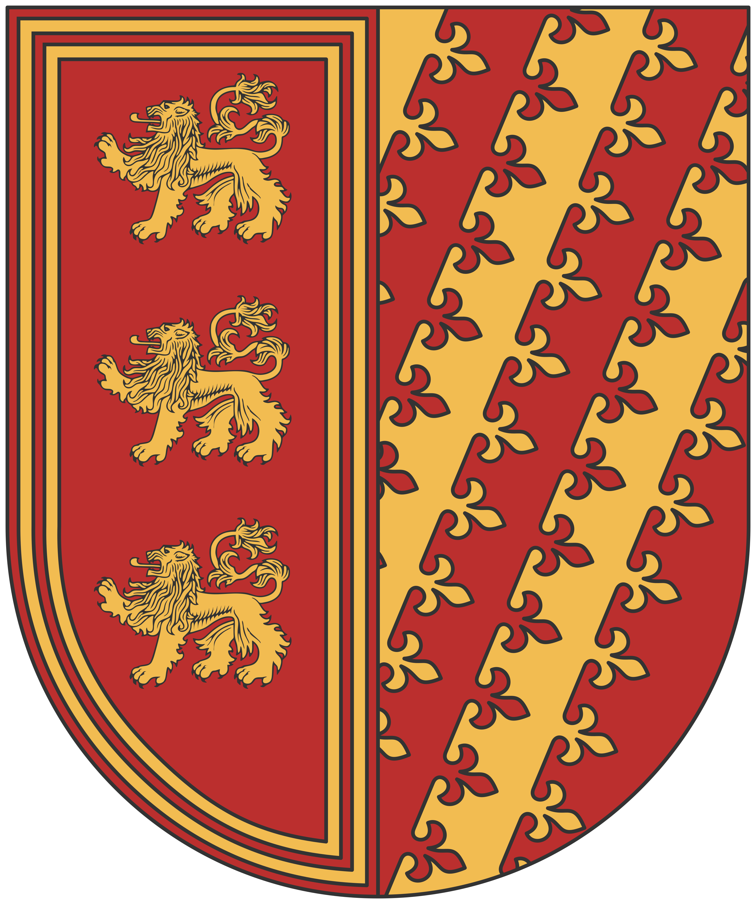

# Confédération des couronnes libres

La Confédération n’est pas née d'une prophétie ou d'une conquête héroïque, mais d'une nécessité amère. Pendant des siècles, le territoire n'était qu'une mosaïque de petits fiefs et de baronnies se querellant pour des droits de péage ou des puits artésiens. On appelait ces seigneurs les « Petites Couronnes », car leur autorité ne dépassait souvent pas l'ombre de leurs propres remparts.

L'unification fut imposée par le **Fléau Errant**. Ce n'était pas une guerre déclarée, mais une pression constante exercée par des créatures qui rôdaient par bandes sur ces terres. Ces bêtes impitoyables ne bâtissaient rien, elles traversaient le paysage en dévorant tout sur leur passage. Face à ces êtres que le fer peinait à arrêter et qui ne connaissaient ni la trêve ni la peur, un seigneur seul était une proie ; plusieurs seigneurs ensemble devenaient une forteresse. Le pacte fut signé non par amitié, mais pour que les sentinelles des uns protègent les récoltes des autres.

## Géographie

La Confédération s'étire sur deux mondes. Au Nord, le climat est clément, marqué par des rivages méditerranéens où l'on cultive l'olive et la vigne sous un azur constant. Mais plus l'on descend vers le Sud, plus la terre se crispe. Les plateaux verdoyants laissent place à des déserts arides et des étendues de sable brûlant, là où les puits sont plus précieux que l'or et où les Petites Couronnes se sont fortifiées contre les vents et les rôdeurs des sables.

## La Foi

La grande majorité de ces royaumes suit le **Varunat**. Cependant, loin de l'austérité du continent ou du faste de [[Cité de Léos|Léos]], les Sudistes pratiquent une foi pragmatique. Pour eux, Varûn est la **Source** : le feu qui forge le fer contre les bêtes et la chaleur qui fait vivre le désert. Ils ne voient pas l'or comme un objet de culte, mais comme l'outil qui permet d'acheter des mercenaires ou le grain des voisins. C'est une union fragile, tenue par le souvenir de ce qui rôde encore dans les hautes herbes et les dunes lointaines.

## Représentation populaire

Les habitants de la Confédération incarnent la figure du "Marchand-Soldat", maniant le contrat aussi bien que la lame. Admirée pour son opulence, l’Union est pourtant perçue comme un édifice instable, maintenu par la seule inertie depuis que la menace des créatures errantes s'est estompée. On reproche à la Confédération une gestion opportuniste, où la sécurité exemplaire des routes caravanières camoufle une tyrannie domestique implacable.

Si les cités sudistes sont les plus prospères, elles sont aussi les plus funestes : le pilori et l'exil définitif dans les déserts arides y sanctionnent quotidiennement les débiteurs ou les espions. Les Sudistes sont cultivés et travailleurs, mais leur protectionnisme farouche confine à une xénophobie assumée ; il n’existe pas de peuple plus fier de leur terre.
