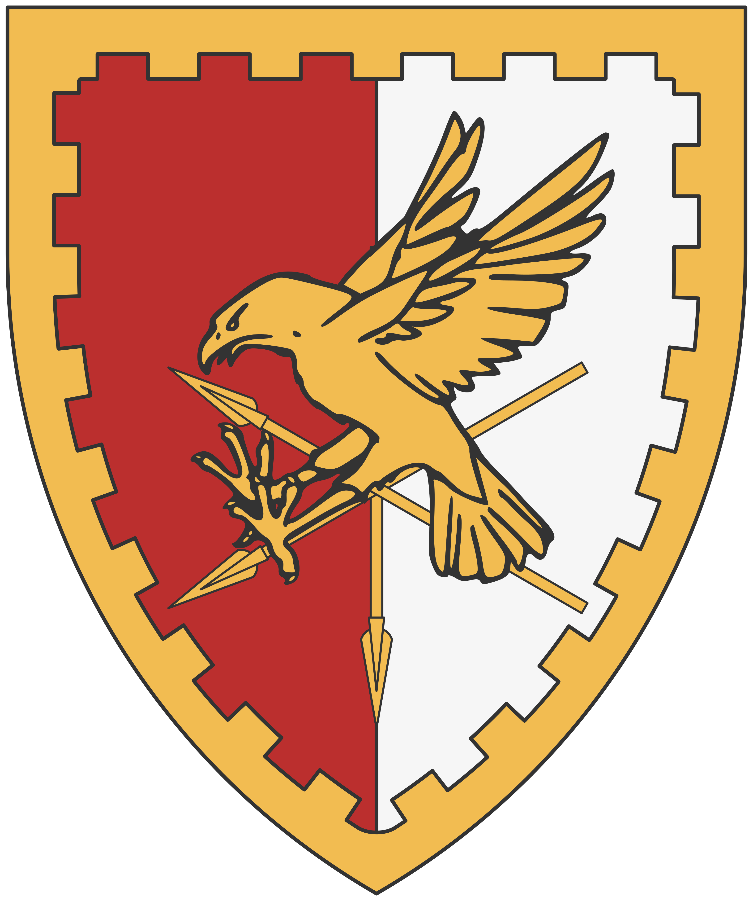

# Le royaume de Dolph

Le royaume de Dolph s'étend sur les vastes plaines fertiles du nord-ouest du continent, bordé par les méandres de la rivière **Vienne** et la mer d'**Esteron**. C’est un territoire de vallées douces et de collines verdoyantes, protégé par un climat tempéré qui contraste avec l'aridité du sud ou la rudesse du nord-est. Sa capitale, une cité fortifiée entourée de cercles de remparts fleuris et d'ouvrages d'art, est considérée comme le centre culturel et aristocratique du pays.

La puissance de Dolph repose sur sa stabilité foncière et la richesse de ses terres. Dolph impose son influence par le contrôle des ressources terrestres et une organisation féodale très structurée. La maison royale maintient son autorité à travers un réseau complexe de vassalité, où la chevalerie occupe une place centrale. Les tournois, les cérémonies de cour et l'étiquette y sont pratiqués avec une rigueur qui frise l'obsession, faisant de ce royaume le modèle de la noblesse traditionnelle pour l'ensemble du monde connu.

## Économie

Le royaume de Dolph est souvent qualifié de « Grenier du Monde ». Son économie est quasi exclusivement basée sur l'agriculture intensive et l'élevage de prestige. La production de blé, d'orge et de fruits est si abondante qu'elle permet d'approvisionner la majorité des cités-états voisines, y compris l'île de Léos qui dépend de Dolph pour sa subsistance alimentaire. Cette dépendance mutuelle, la nourriture contre l'or, est le pilier de la géopolitique régionale.

L'autre pilier économique est la viticulture et la production de tissus de luxe comme le lin et la laine fine. Les vins de Dolph sont exportés jusqu'aux tables les plus prestigieuses du continent, générant des revenus constants pour la couronne. De plus, le royaume possède les plus célèbres haras du continent ; les chevaux de guerre élevés dans les plaines de Dolph sont réputés pour leur endurance et leur élégance, constituant un produit d'exportation stratégique vers les armées et nobles extérieurs.

## Représentation populaire

Aux yeux du reste du monde, les habitants de Dolph sont perçus comme des esthètes un peu vains, plus préoccupés par la coupe de leurs manteaux ou la rime de leurs poèmes que par la réalité des combats. On leur reproche souvent une forme de superficialité et une arrogance polie. Dans les provinces plus rudes, on plaisante volontiers sur le fait qu'un soldat de Dolph passerait plus de temps à brosser sa monture qu'à affûter sa lame.

Toutefois, cette image de "douceur" est trompeuse. Les observateurs attentifs savent que derrière le faste des jardins et des salons se cache une diplomatie féroce et une puissance militaire lourde. La chevalerie de Dolph, bien que portée sur le protocole, reste une force de frappe redoutable sur terrain découvert. Les habitants sont fiers de leur héritage et considèrent leur mode de vie comme le sommet de la civilisation, voyant dans les autres cultures soit des barbares, soit des marchands sans honneur.

## Spiritualité

Dolph suit scrupuleusement le **Varunat** traditionnel. Ici, Varûn n'est pas l'œil qui brûle ou le feu destructeur, mais la « Douce Chaleur », la force vitale qui fait germer les semences et mûrir les vignes. Le clergé local est puissant et riche, travaillant main dans la main avec la noblesse pour maintenir l'ordre social. Les églises de Dolph sont souvent des chefs-d'œuvre d'architecture légère, laissant entrer une lumière abondante pour glorifier l'astre solaire.

### Plats typiques

- **La "Tarte des Moissons"** : Une pâtisserie fine à la croûte dorée, garnie de fruits du verger confits dans un vin liquoreux et parsemée de fleurs comestibles séchées. C’est un plat d’apparat servi lors des fêtes de la floraison, symbolisant l'abondance et la générosité de la terre. Sa texture est à la fois croustillante et fondante, dégageant un parfum sucré très persistant.