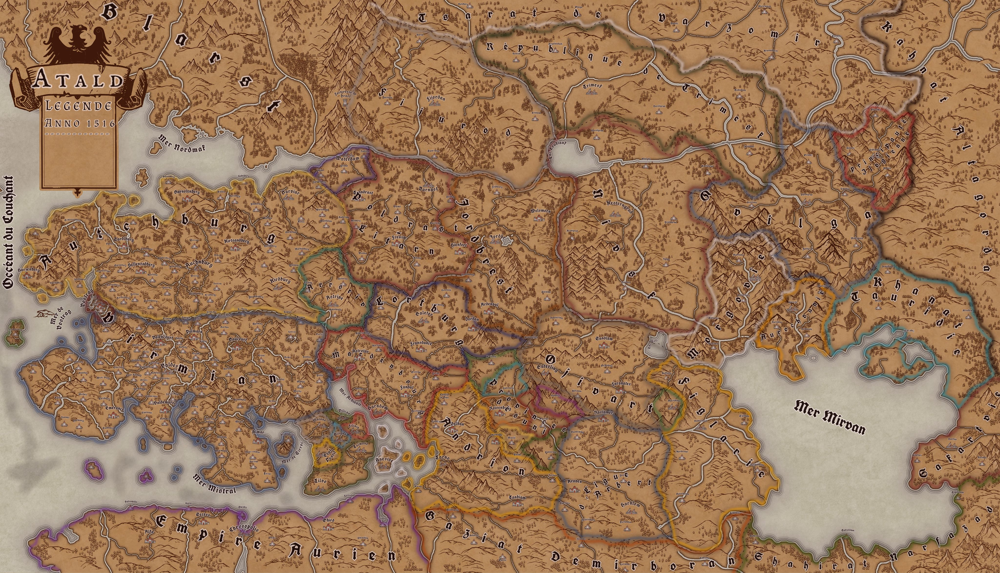

# 🏰 Bienvenue sur Atald

Bienvenue sur le serveur **Atald**, un monde médiéval de quêtes et de mystères.  
Si vous avez des questions ou des soucis, n'hésitez pas à passer sur notre [serveur Discord](https://discord.gg/S6FZ9zWDkr).

## Date actuel : 1516 du calendrier Dastaiste

(Il est a prendre en compte que le Lore n'est pas encore complet, et que sa mise en forme n'est pas encore optimal, notamment a cause des fautes d'orthographe qui le parcours.)

  

---
# Légende :
## Importance : 
- `🔴 : Forte`
- `🟡 : Moyenne`
- `🟢 : Faible`
## Type : 
- `🔺 : Personnage`
- `🔴 : Lieu`
- `🟥 : Autre`

---

## 🔗 Navigation rapide

- [Consultez le règlement du serveur](regles.html)
- [Le Royaume de Virmian](Virmian_base.html)
- [Capsule de lore](capsules/index_capsule.html)
